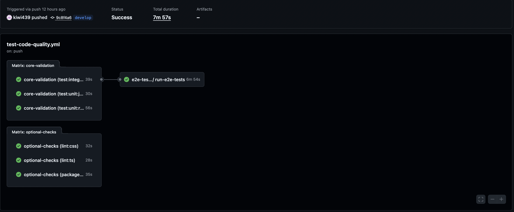

# Budoman frontend

## About project

Budoman-front is a frontend application representing construction shop. It allows to login and register users, making orders, savings to newsletter, access to user's panel etc...

## Application setup
1. Make sure that you have filled .env file
2. Make sure that you have Docker installed on your local machine
3. Run the following command to start the application:

To start app use:
```bash
SSH_PUB_KEY=$(cat ~/.ssh/id_ed25519.pub) docker-compose build --no-cache # Update path to public SSH key
SSH_PUB_KEY=$(cat ~/.ssh/id_ed25519.pub) docker-compose up # App should be available on port 3003
```

Application uses Typescript so when you'll open it inside code editor will start to get error "Could not find a declaration file for module...". To handle this in VSCode use extension "Dev Containers" and open app using this. It should solve problems with external packages.

## Code quality
Inside packages.json are defined several scripts to check code quality.
They are induced after commiting something to repository to check code quality and correctness.
Some of them are optional - linters, and packages usefulness (may be broken because doesn't affect on how application works) and some of them critical to make sure application works properly - various tests.



```bash
npm run packages:validate-usefulness # to launch tool which checks which gems are not used
npm run lint:css # To launch linter for CSS files
npm run lint:ts # To launch linter for JS, TS files
npm run test:unit:jest # to launch unit tests written with JEST
npm run test:unit:rtl # To launch unit tests written with RTL
npm run test:integration # To launch integration tests written with RTL
```

## Deploy
To make a deploy on PROD env use:
```bash
bin/deploy.sh
```
